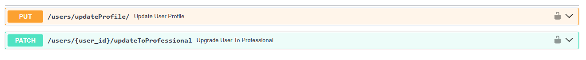

Implementation for Feature 9: User Profile Management
In this update, I successfully implemented enhancements to the user profile management functionality, providing the ability for users to update their profile fields and enabling managers and admins to upgrade users to professional status.

Implemented API Endpoints:
/users/updateProfile
This endpoint allows users to update their profile data, such as their name, bio, location, etc., offering a flexible and user-friendly experience for profile management.

/users/{user_id}/updateToProfessional
This endpoint enables managers and admins to update a user's status to "professional," empowering the administrative team to manage user designations and ensure proper user categorization.

Email Notification System
An email notification is automatically sent to users once their designation is upgraded to "professional." This ensures users are informed of their updated status and promotes a seamless user experience.

Technical Updates and Deployment:
Due to some vulnerabilities in the initial setup, the CI/CD pipeline failed. To resolve this and ensure a successful deployment, I updated the following dependencies:

PyMySQL==1.1.1
starlette>=0.40.0
fastapi>=0.103.0

Testing and Quality Assurance:
I added over 10 test cases to ensure thorough coverage of all scenarios related to user profile updates and professional status upgrades. The tests validate both the functionality and edge cases, ensuring robustness and reliability.

The detailed code changes and test cases for this feature can be found in the following GitHub repository:
GitHub Link: [Feature 9 Implementation](https://github.com/njit-dl92/user_management/blob/feature/feature_9_implementation)

